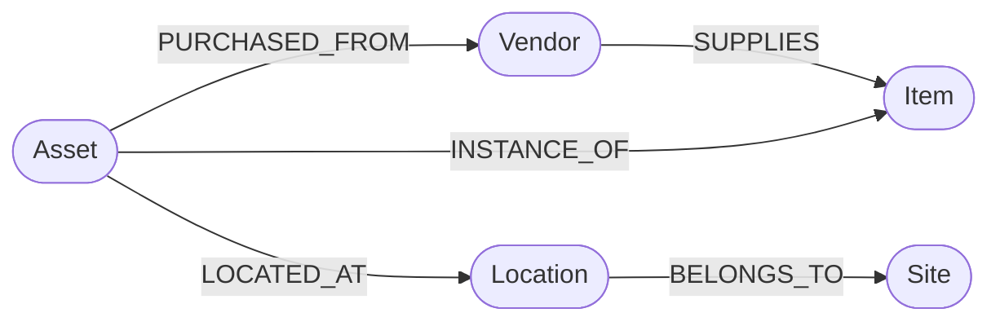

# AI Inventory Knowledge Graph Assistant

An end-to-end knowledge-graph assistant that converts natural-language inventory questions into validated Cypher, performs multi-hop reasoning over Neo4j relationships, and returns grounded answers with interactive graph path visualization.

[](https://github.com/Abdelazimm/inventory-neo4j-ai-chatbot/actions)
[](https://www.python.org/)
[](https://fastapi.tiangolo.com)
[](https://neo4j.com/)
[](https://github.com/langchain-ai/langgraph)
[](https://reactjs.org/)

---

## 🎯 Why a Knowledge Graph for Inventory?
Traditional relational databases excel at isolated table aggregations, but struggle with complex, multi-hop relationship traversals (e.g. *"Which suppliers provide parts that are installed in assets across multiple geographic facilities?"* or *"Trace the full procurement and deployment lineage of a critical asset"*).

In a Knowledge Graph:
* **Entities as First-Class Nodes**: Assets, Items, Vendors, Locations, and Sites are connected natively without expensive multi-table join cascades.
* **Multi-Hop Traversal**: Enables multi-hop reasoning across 3–5 degrees of relationship in single Cypher statements.
* **Intuitive Path Visualization**: Graph traversals are directly serializable and visualizable in the UI.



---

## 🚀 Key Features

* **Dynamic Graph Schema Introspection**: Fetches live labels, relationship types, directional triples, and constraints directly from Neo4j.
* **Structured Text-to-Cypher Generator**: Produces Pydantic-validated Cypher query definitions from natural language.
* **Programmatic Cypher AST & Safety Validator**: Blocks mutating commands (`CREATE`, `MERGE`, `SET`, `DELETE`, `DETACH DELETE`, `DROP`, `LOAD CSV`, `apoc.export`), enforcing strict read-only execution.
* **Autonomous Self-Correction Engine**: Analyzes Neo4j syntax and schema execution errors with up to 3 iterative self-correction cycles.
* **Interactive Graph Visualization**: Automatically renders traversed subgraphs and directional relationship paths in the web UI.
* **Neo4j Aura & Local Compatible**: Seed scripts (`scripts/seed_neo4j.py`) support cloud-hosted Neo4j Aura instances (`neo4j+s://`) or local Docker instances.
* **Graph CSV Ingestion**: Upload bulk CSVs to instantiate nodes or relationships with parameterized Cypher MERGE.
* **Safe Parameterized Graph Mutations**: Record modification/deletion mediated via 2-step verification preview and RBAC authorization.
* **Modern Web Interface**: React 18 + Vite + TypeScript frontend with dark theme aesthetics, Cypher query telemetry, session management, and visual node pill badges.

---

## 💬 Example Multi-Hop Questions

* *"Which sites contain assets supplied by TechSupply Inc?"*
* *"Which vendors supply items stored in more than one site?"*
* *"Show the relationship path from TechSupply Inc to Headquarters."*
* *"Which customers placed orders containing items supplied by TechSupply Inc?"*
* *"Which location contains the most expensive asset?"*
* *"What is the total value of assets located in European Hub?"*

---

## 🛠️ Quick Start

### 1. Prerequisites
- Python 3.10+
- Node.js 18+
- Neo4j Instance (Local Desktop, Docker, or [Neo4j Aura Cloud](https://neo4j.com/cloud/platform/aura-graph-database/))
- OpenAI API Key

### 2. Configuration (`.env`)
```bash
# Clone and navigate
cd inventory-neo4j-ai-chatbot

# Virtual Environment
python -m venv venv
# Windows:
venv\Scripts\activate
# Linux/macOS:
source venv/bin/activate

pip install -r requirements.txt
cp .env.example .env
```

Configure `.env`:
```env
OPENAI_API_KEY=your_openai_key
NEO4J_URI=neo4j+s://your-instance.databases.neo4j.io
NEO4J_USERNAME=neo4j
NEO4J_PASSWORD=your_aura_password
NEO4J_DATABASE=neo4j
```

### 3. Seed Knowledge Graph
```bash
# Initialize constraints
python scripts/init_neo4j.py

# Populate the full inventory graph dataset
python scripts/seed_neo4j.py
```

### 4. Run Backend & Frontend
```bash
# Start FastAPI Backend
uvicorn app.main:app --host 127.0.0.1 --port 8001 --reload

# Start React Frontend
cd frontend
npm install
npm run dev
```
Open [http://localhost:5174](http://localhost:5174) in your browser.

Default Test Accounts:
- **Admin**: `admin` / `admin123`
- **Manager**: `manager` / `manager123`
- **Viewer**: `viewer` / `viewer123`

---

## 🐳 Docker Deployment

Run Neo4j, FastAPI, and the React frontend with Docker Compose:

```bash
docker compose up --build
```
Access the application at [http://localhost:3001](http://localhost:3001).

---

## 🧪 Testing & Evaluation

### Run Test Suite
```bash
pytest -v
```

### Run AI Evaluation Benchmark (35 Questions)
```bash
python -m eval.run_evaluation
```

Sample Benchmark Output:
```text
=======================================================
  INVENTORY NEO4J KNOWLEDGE GRAPH EVALUATION REPORT
=======================================================
Total Evaluations:        35
Intent Accuracy:          100.0%
Cypher Validity Rate:     100.0%
Security Defense Rate:    100.0%
Average Latency:          10.8 ms
Average Retries:          0.0
=======================================================
```

---

## 🔒 Security Architecture
* Read-only connection execution for generated analytics.
* Cypher safety validator blocking arbitrary graph mutations and administrative APOC procedures.
* 2-step verification for safe parameterized graph updates.
* See [docs/security.md](docs/security.md) for full security documentation.

---

## 📄 License
MIT License.
