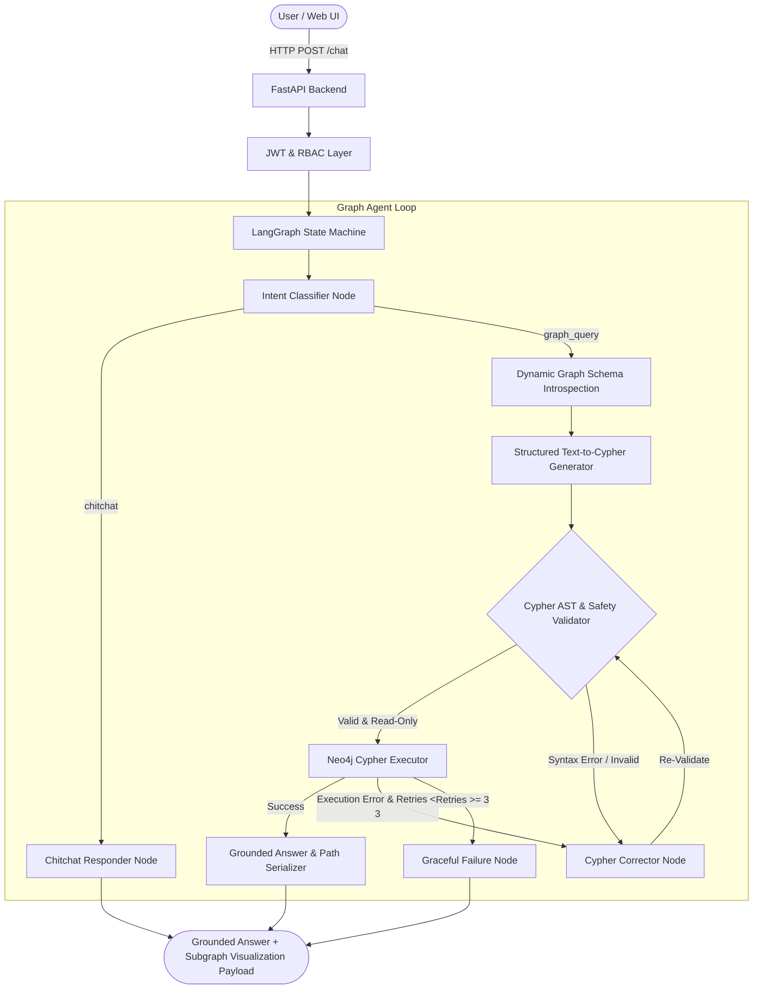

# Architecture & System Design: Inventory Neo4j Knowledge Graph Assistant

## Overview
The **Inventory Neo4j Knowledge Graph Assistant** is a specialized conversational graph intelligence system engineered for multi-hop supply chain exploration, asset lineage tracking, and knowledge graph analytics. Built on **LangGraph**, **Neo4j 5**, **FastAPI**, and **React**, it translates natural language into optimized Cypher statements while ensuring read-only AST safety, self-correction, and interactive path visualization.

## Architectural Highlights

### 1. Dynamic Neo4j Schema Introspection (`app/agents/schema.py`)
Queries live node labels, relationship types, and directional triples directly from Neo4j (`CALL db.labels()`, `CALL db.relationshipTypes()`, `MATCH (a)-[r]->(b)`), falling back to canonical taxonomy if the graph instance is offline.

### 2. Multi-Hop Graph Reasoning
Allows stakeholders to ask complex connected questions without understanding graph databases (e.g. tracing an asset instance back to its catalog item, the supplier who provided it, the room location it resides in, and the geographical site hosting it).

### 3. Programmatic Cypher AST & Safety Validator (`app/agents/validator.py`)
- Programmatically enforces read-only operations (`MATCH`, `OPTIONAL MATCH`, `WITH`, `WHERE`, `RETURN`, `ORDER BY`, `LIMIT`).
- Strictly blocks destructive commands (`CREATE`, `MERGE`, `SET`, `DELETE`, `DETACH DELETE`, `REMOVE`, `DROP`).
- Blocks unauthorized procedures (`CALL dbms.*`, `CALL apoc.export.*`) and `LOAD CSV`.

### 4. Interactive Graph Path Rendering (`frontend/src/components/GraphVisualization.tsx`)
When Cypher queries return paths or connected nodes/edges, the backend serializes the subgraph topology into a clean JSON payload (`nodes`, `edges`), allowing the React frontend to display the graph traversal alongside the conversational explanation.
