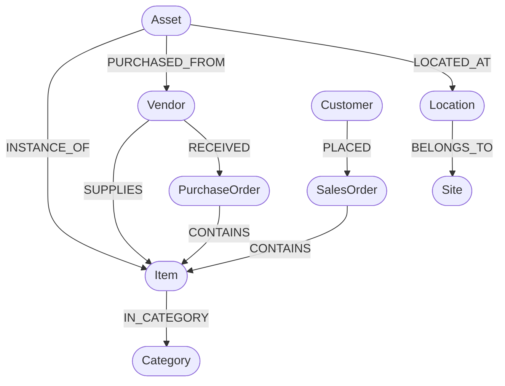

# Inventory Knowledge Graph Data Model & Taxonomy

## 1. Node Labels & Property Definitions

| Node Label | Identifier Property | Key Properties | Description |
| :--- | :--- | :--- | :--- |
| **`Asset`** | `asset_tag` (String, UNIQUE) | `name`, `cost`, `status`, `serial_number`, `purchase_date` | A physical, tracked piece of equipment or hardware. |
| **`Item`** | `item_code` (String, UNIQUE) | `name`, `unit_of_measure` | A generic catalog product or SKU definition. |
| **`Vendor`** | `vendor_code` (String, UNIQUE) | `name`, `email`, `phone`, `city`, `country` | An approved supplier or distributor. |
| **`Site`** | `site_code` (String, UNIQUE) | `name`, `city`, `country`, `timezone` | A physical facility, campus, or warehouse. |
| **`Location`** | `location_code` (String, UNIQUE)| `name` | A specific room, floor, or aisle within a Site. |
| **`Category`** | `name` (String, UNIQUE) | `name` | A classification taxonomy (e.g., Electronics, Furniture). |
| **`Customer`** | `customer_code` (String, UNIQUE)| `name`, `email`, `city` | A client or business purchasing items. |
| **`PurchaseOrder`**| `po_number` (String, UNIQUE) | `order_date`, `status`, `total_amount` | Procurement orders sent to Vendors. |
| **`SalesOrder`** | `so_number` (String, UNIQUE) | `order_date`, `status`, `total_amount` | Customer fulfillment orders. |

---

## 2. Graph Relationship Topology & Semantics



### Relationship Matrix:
1. `(:Vendor)-[:SUPPLIES]->(:Item)`: Declares that a vendor offers a specific catalog item.
2. `(:Asset)-[:INSTANCE_OF]->(:Item)`: Maps an individual serial-tracked asset back to its catalog SKU.
3. `(:Asset)-[:PURCHASED_FROM]->(:Vendor)`: Tracks the vendor who supplied a physical asset.
4. `(:Asset)-[:LOCATED_AT]->(:Location)`: Physical location assignment.
5. `(:Location)-[:BELONGS_TO]->(:Site)`: Site hierarchy containment.
6. `(:Item)-[:IN_CATEGORY]->(:Category)`: Categorization.
7. `(:Vendor)-[:RECEIVED]->(:PurchaseOrder)`: Procurement order linkage.
8. `(:PurchaseOrder)-[:CONTAINS {quantity, unit_price}]->(:Item)`: Purchase order line items.
9. `(:Customer)-[:PLACED]->(:SalesOrder)`: Customer order attribution.
10. `(:SalesOrder)-[:CONTAINS {quantity, unit_price}]->(:Item)`: Sales order line items.

---

## 3. Uniqueness Constraints & Indexes
All core node labels enforce uniqueness on their natural keys:
```cypher
CREATE CONSTRAINT unique_asset_tag IF NOT EXISTS FOR (a:Asset) REQUIRE a.asset_tag IS UNIQUE;
CREATE CONSTRAINT unique_vendor_code IF NOT EXISTS FOR (v:Vendor) REQUIRE v.vendor_code IS UNIQUE;
CREATE CONSTRAINT unique_item_code IF NOT EXISTS FOR (i:Item) REQUIRE i.item_code IS UNIQUE;
CREATE CONSTRAINT unique_site_code IF NOT EXISTS FOR (s:Site) REQUIRE s.site_code IS UNIQUE;
CREATE CONSTRAINT unique_location_code IF NOT EXISTS FOR (l:Location) REQUIRE l.location_code IS UNIQUE;
CREATE CONSTRAINT unique_customer_code IF NOT EXISTS FOR (c:Customer) REQUIRE c.customer_code IS UNIQUE;
CREATE CONSTRAINT unique_po_number IF NOT EXISTS FOR (po:PurchaseOrder) REQUIRE po.po_number IS UNIQUE;
CREATE CONSTRAINT unique_so_number IF NOT EXISTS FOR (so:SalesOrder) REQUIRE so.so_number IS UNIQUE;
CREATE CONSTRAINT unique_category_name IF NOT EXISTS FOR (cat:Category) REQUIRE cat.name IS UNIQUE;
```
